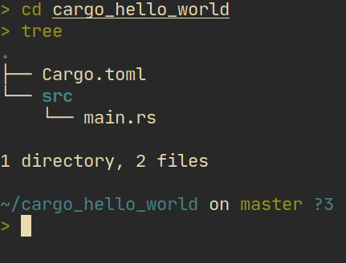

# Cargo

কার্গো হচ্ছে রাস্ট এর অফিসিয়াল প্যাকেজ ম্যানাজার। এটার মাধ্যমে আমরা আমাদের প্রজেক্ট নিয়ে কাজ করবো। এটা দিয়ে বাইনারি কিংবা লাইব্রেরী তৈরি করা যায়। তো, আমরা এবার একটা বাইনারি প্যাকেজ তৈরি করে দেখবো আর এটা কিভাবে রান করতে হয় তা দেখবো।

## প্যাকেজ তৈরি করা

আমরা নিচের কোড যদি রান করি তাহলে `cargo_hello_world` নামের একটা ডাইরেক্টরি তৈরি হবে:

```bash
cargo new cargo_hello_word
```

সেখানের স্ট্রাকচার হবে নিচের মতো:



এখানে `Cargo.toml` হচ্ছে প্যাকেজ ইনফো। আর `src/main.rs` এ আমাদের কোড থাকবে। `Cargo.toml` ওপেন করলে নিচের জিনিস আমরা দেখতে পারবো:

```toml
[package]
name = "cargo_hello_world"
version = "0.1.0"
edition = "2021"

# See more keys and their definitions at https://doc.rust-lang.org/cargo/reference/manifest.html

[dependencies]
```

এখানে আমরা লক্ষ্য করলে দেখব‌ো `name` হচ্ছে আমাদের প্যাকেজ এর নাম আর `version` হচ্ছে আমাদের প্যাকেজ এর ভার্সন। `edition` আর `[dependency]` নিয়ে আপাতত আমরা মাথা ঘামাবো না।

এবার আমরা প্রোগ্রাম রান করার জন্য রান করবো `cargo run`. এটা আমাদের জন্য প্রোগ্রামটা বিল্ড করবে আর তারপর রান করবে। রান হলে আমরা টার্মিনাল এ `Hello, world!` পাবো। কারণ কার্গো বাই ডিফল্ট হেলো ওয়ার্ল্ড এর ক‌োড জেনারেট করে।

একটু আগে যেভাবে রান করলাম সেটাকে `debug` বিল্ড বলে। এই মোডে কম্পাইল স্পিড বেশি হলেও প্রোগ্রাম স্লো হয়। আমরা এই মোড ব্যবহার করবো development করার সময়। আরেকটা মোড আছে যেটাকে বলে রিলিজ মোড। এই মোডে কম্পাইলার অনেক optimization করে বলে প্রোগ্রাম অনেক ফাস্ট হয় কিন্তু কম্পাইল করতে সময় বেশি লাগে। এজন্য এই মোড আমরা তখনই ব্যবহার করবো যখন আমরা ইউজারদের জন্য প্রোগ্রাম বিল্ড করবো। রিলিজ মোডে বিল্ড করতে হলে নিচের কোড রান করতে হবে:

```sh
cargo run --release
```

এবার দেখি আমাদের প্রোগ্রাম কোথায় থাকে সেটা দেখতে। কম্পাইল যদি ডিবাগ মোডে করি তাহলে তা থাকবে `target/debug/cargo_hello_world` এ। আর রিলিজ মোডে থাকবে `target/release/cargo_hello_world` এ। উইন্ডোজ এর ক্ষেত্রে এদের সাথে `.exe` থাকবে।
