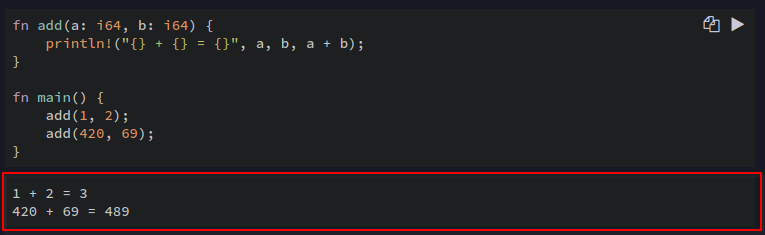

# দীর্ঘ এক পথচলার আরম্ভ

রাস্ট শিখতে অনেক সময় এবং শ্রম দিতে হবে। এই দীর্ঘ যাত্রা শুরু করার সিদ্ধান্ত নেবার জন্য আপনাকে অভিনন্দন জানাচ্ছি।

এই অংশে যা নিয়ে আলোচনা করা হবে:

- কিভাবে `windows`, `linux` কিংবা `macOS` এ রাস্ট ইনস্টল করতে হবে
- রাস্ট দিয়ে `Hello World`
- রাস্টের প্যাকেজ ম্যানাজার `Cargo` দিয়ে প্রথম প্যাকেজ তৈরি করা

## এই বই পড়ার জন্য কিছু নির্দেশনা

বইয়ের কোড সরাসরি রান করতে চাইলে কোড এর পাশে রান বাটনে ক্লিক করতে হবে। এতে কোড রান করার পর নিচে আউটপুট আসবে।

রান করার পর এটির ঠিক নিচে আউটপুট আসবে:

আর, রাস্টে প্রোগ্রামিং করার সময় সবচেয়ে বড় সহায়ক হচ্ছে রাস্ট কম্পাইলার এর এরর মেসেজ। রাস্ট এর কম্পাইলার খুব সুন্দরভাবে এরর
মেসেজ দেখায় যেখানে সেটি প্রোগ্রামার এর ভুল ধরে দেয়, সেগুলোর ব্যাখ্যা দেয় এবং সম্ভব হলে তা কিভাবে ঠিক করতে হবে সেটাও দেখিয়ে দেয়।
তাই কোড কম্পাইল না হলে ঘাবড়ে না গিয়ে মনোযোগ দিয়ে এরর কোড পড়তে হবে।